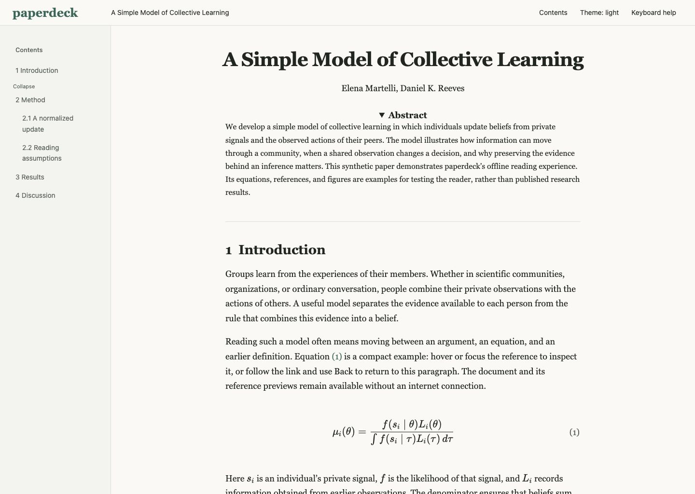

# paperdeck

[](https://github.com/Saber5656/paperdeck/actions/workflows/ci.yml)

paperdeck turns scholarly PDFs, LaTeX projects, and arXiv papers into self-contained HTML reading decks. The result keeps section navigation, reference jumps, equation previews, a table of contents, keyboard controls, and a browser reader that works offline.



## Install

Install [uv](https://docs.astral.sh/uv/getting-started/installation/) and Pandoc
before running the source checkout. Pandoc is required for the LaTeX example:

```sh
# macOS
brew install pandoc
# Debian/Ubuntu
sudo apt-get install pandoc
# Fedora
sudo dnf install pandoc
```

```sh
git clone https://github.com/Saber5656/paperdeck.git
cd paperdeck
uv sync --locked
uv run paperdeck doctor --offline
uv run paperdeck convert examples/reading-demo.tex --offline --output reading-demo.html
```

The MVP is available from source. A stable package has not yet been published to
PyPI. To install the current checkout as a command, use `uv tool install .` or
`pipx install .`; otherwise prefix commands below with `uv run`.

Set an LLM provider for the PDF engine. The engine sends extracted paper text and cropped equation images only when it needs structure, bibliography, citation, or equation transcription help.

```sh
export OPENAI_API_KEY="..."
```

An OpenAI-compatible local server needs no key. For Ollama, put this in `~/.config/paperdeck/config.toml`:

```toml
[llm]
base_url = "http://localhost:11434/v1"
model = "llama3.2"
vlm_model = "llava"
api_key_env = "OLLAMA_API_KEY"
cache = true
max_cost_usd = 0.0

[llm.pricing."llama3.2"]
input_per_mtok = 0.0
output_per_mtok = 0.0

[llm.pricing."llava"]
input_per_mtok = 0.0
output_per_mtok = 0.0
```

## Quickstart

```sh
paperdeck convert 2401.12345 --output out.html
paperdeck convert paper.tex --output out.html
paperdeck convert paper.pdf --engine pdf --output out.html
```

Each command writes one self-contained HTML file. Use `paperdeck doctor --json` to check local prerequisites before converting.

## Reader features

| Feature | How to use |
| --- | --- |
| Section jumps | Click the table of contents or press `j`/`k` |
| Figure/table previews | Hover or keyboard-focus an internal reference |
| Equation previews | Hover or focus an equation reference; PDF transcriptions stay marked unverified |
| Table of contents | Press `t` to show or hide it |
| Themes | Press `d` to cycle automatic, light and dark mode |
| Reading position | The reader restores the last position in local browser storage |
| Keyboard navigation | `j`/`k` move between sections, `Backspace` returns from a jump, `?` shows keys |

## Engines

| Input | Engine and fidelity | Cost and offline behavior |
| --- | --- | --- |
| arXiv ID | arXiv HTML when available; LaTeX source fallback | Network fetch; `--offline` uses cache |
| `.tex` or source archive | LaTeX/Pandoc engine, highest semantic fidelity | Local and offline after dependencies are installed |
| `.pdf` | PDF text layout plus deterministic crops; best-effort semantic recovery | Requires a configured model endpoint; caches responses; PDF conversion is unavailable with `--offline` |

Select explicitly with `--engine latex`, `--engine pdf`, or `--engine arxiv-html` when the input supports more than one path. PDF conversion asks for estimated-cost confirmation (`--yes` for scripts). Declining stops conversion. Every physical model request is budget-checked, including retries. Low-confidence equation transcriptions retain the source image and a warning.

## Limitations

PDFs do not contain the full semantic structure of a source document. Column detection, reading order, bibliography parsing, and citation linking therefore use conservative heuristics and may produce `unhandled` blocks. Equation images are the source of truth; PDF-engine VLM LaTeX is an unverified transcription and is never treated as authoritative. Complex LaTeX packages, custom fonts, unusual macros, scanned PDFs, and malformed files can reduce fidelity. See [`docs/DESIGN.md`](docs/DESIGN.md) and [`docs/decisions/`](docs/decisions/) for the canonical design and tradeoffs.

## Privacy and security

Generated HTML contains vendored assets and makes zero external requests. The PDF engine sends paper text and cropped images to the configured LLM provider only when conversion requires it; local LaTeX and cached offline conversions do not send those requests. Read [`SECURITY.md`](SECURITY.md) before processing untrusted documents.

## 日本語

paperdeck は、論文 PDF・LaTeX・arXiv を、参照ジャンプや数式プレビューを備えた単一の HTML へ変換します。MVP は上記のソース導入手順で利用できます。PyPI への安定版公開は未実施です。LaTeX 入力には Pandoc が必要です。PDF 変換は設定した LLM へ本文や数式画像を送り、実行前に概算費用を確認します。生成された HTML はオフラインで読めます。PDF 変換そのものの `--offline` 実行は未対応です。詳しい仕様・制約は [`docs/DESIGN.md`](docs/DESIGN.md)、安全な利用方法は [`SECURITY.md`](SECURITY.md) を参照してください。
